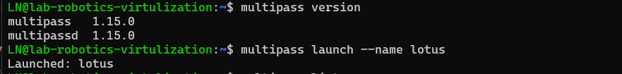

# Assignment 7: Linux Virtualization

Name:Lotus Nyaupane
Author :amk1001854@student.hamk.fi
***
Part 1:Introduction to virtualization concepts 
***
Virtualization: It is the process of creating the deplicate or fake package of something without any need of hardware,storage or network resources

Hypervisor: It is a special software which creates and manages the vitrual machine(vm) on a single physical computer. In addition it allowys multiple opterating system to run on same hardware without disturbing each other program

Virtual Machines (VMs):A Virtual Machine (VM) is a software based computer machine which execute  inside another physical computer. It acts like a real computer, with its own operating system (OS), applications, and storage, but it shares the hardware of the physical computer with other VMs.

Container: A container is like a lightweight, portable box that holds everything an app needs to run (code, settings, and dependencies).
It ensures the app works the same way everywhere, whether on your laptop, a server, or the cloud


***
 Diffrence between VMs and Container:

 Here is the diffrence between Vms and container in  Architecture, Resource Utilization and Isolation
-The difference between VMs and Containers in terms of Architecture, Resource Utilization, and Isolation
 

|   Aspects  | Virtuals Machines(Vms)   | container     |
|--------------------|----------------------|--------------------------|
| **Architecture** |  Each VM runs a full OS on top of a hypervisor. | Containers share the host OS kernel but run isolated applications.|
| **Resource Utilization**|Requires more resources (CPU, RAM, Storage) because each VM includes an OS.|More lightweight and efficient since they don’t require a full OS.|
| **Isolation**|Strong isolation As Each VM has its own OS, so issues in one VM don’t affect others.|Weaker isolation  Containers share the host OS, so security risks may be higher.|


Where  the diffrence between the container is :


## part 2: Multipass Implementation

1. Installation
```
   sudo snap install multipass
```


2. Launch a default Ubuntu instance
```
   multipass launch --name lotus
```


3. View details about an instance
```
   multipass info lotus
```


4. Access the shell of a running instance
```
   multipass shell lotus
```


5. Stop, delete and purge an instance
```
   multipass stop lotus
   multipass delete lotus
   multipass purge
```


## Learn About Cloud-Init Configuration

### Create a cloud-init.yaml file to customize an instance.
            nano cloud-init.yaml

        

### Some code for execution of file

            multipass launch --name cloud-instance --cloud-init cloud-init.yaml


 #### To verify the configuration

        multipass shell cloud-instance
        cat /home/devuser/welcome.txt
           
           

## Step 2: File Sharing in Multipass
 
 ### lets create  one shared folder
 
  So here is the step to for sharing the file and full steps i had directly put output in all together rather than giving each and every output so i these are the code to follow on and steps to be carried on

 Step 1: Create a Shared Folder on the Host Machine
  Run the following command to create a directory on your host machine that will be shared with the Multipass instance:

```
mkdir -p ~/multipass_shared
```
 Step 2: Mount the Shared Folder to the Multipass Instance
  ```
  multipass mount ~/multipass_shared lotus:/home/devuser/shared
```
 Step 3: Verify Shared Folder Inside the Instance
```
multipass exec lotus -- ls -l /home/devuser/shared
```
Step 4: Add a Test File to the Shared Folder from the Host
```
echo "Hello from host" > ~/multipass_shared/testfile.txt
```
step 5: Check the File from Inside the Instance
```
multipass exec my-instance -- cat /home/devuser/shared/testfile.txt
```
Step 6: Create a File from the Multipass Instance
```
multipass exec lotus -- bash -c 'echo "Hello from Multipass" > /home/devuser/shared/instancefile.txt'
```
Step 7: Check the File from the Host Machine
```
cat ~/multipass_shared/instancefile.txt
```
step 8: Unmount the Shared Folder (Optional)
If you no longer need the shared folder, unmount it with:
```
multipass umount my-instance:/home/devuser/shared
```


 - so both can be acessed from the host and Multipass instance

## part 3:
## Exploring LXD
 ### following steps and code that i had done
  
1. install Snap in WSL and then install LXD:
  ```
  sudo snap install lxd
  ```
2. Enable LXD and Initialize It
 ```
 lxd --version
```
### Basic commands done for the creating managing and intreacting with the Containers

```
 lxc list
 ```
  

 ```
 lxd init
 ```
 

```
lxc list
```


- so i had already done some experiment from watching the february 13 video so i will go to next part now 
# part 4 Dockor
## Concept of Dockor
 - i had gained the importance and the concept of dockor looking from its oficial website and its official documatation.

 

 ### Installing docker in Linux
 ```
 Installation of docker in Linux
 ```

 checking version for verification:

 ```
 docker --version
 ```
 

 ##### Experiment with Docker
since my docker was not running properly so i had uninstall it completely and i had directly put output here


  

  So i had installed the Docker from the website through convinent script 
  the script i had used is 
  ```
  curl -fsSL https://get.docker.com -o get-docker.sh
sudo sh get-docker.sh
Executing docker install script, commit: 7cae5f8b0decc17d6571f9f52eb840fbc13b2737
<...>
  ```
#### Output 
 

 

### Experiments
1. Check if Docker is working by running a test container:

```
         sudo docker run hello-world
```

output:
 

2. List running containers:
```
       sudo docker ps -a
```
3. Pull an official image:    
```  
         docker pull nginx
```
4. Run the nginx container
```
      docker run -d -p 8080:80 nginx

      
```
5. Check running containers
```
 docker ps  
```
6. Check external IP (using curl)
```
       curl ifconfig.me
```

  

7. Check running containers
```
  docker ps  
```
8. Check external IP (using curl)
```
   curl ifconfig.me
```
 


### Stop and remove the container docker stop my-nginx docker rm my-nginx
since i had not  created or started a container named my-nginx yet. 
so the steps i shall follow on and the resulted output from it is given below
```
docker run -d --name my-nginx -p 80:80 nginx
```

#### Now i need to stop and remove so following code is used to operate this function
```
docker stop my-nginx
```
```
 docker rm my-nginx
```
--------
Result:
While performing this operation following result was generates


# Part 5: Snaps for Self-Contained Application

some commands that i had performed to carryout this operation are
```
  sudo apt update && sudo apt install snapcraft -y
```


```
sudo snap install snapcraft --classic
```
```
 mkdir my-snap-app && cd my-snap-app
```
```
 snapcraft init
```
```
  mkdir bin
```
```
nano bin/hello.sh
```
```
 nano bin/hello.sh
```
```
chmod +x bin/hello.sh
```
```
snapcraft
```
```
 sudo snap install my-snap-app_0.1_amd64.snap --dangerous
```
```
 my-snap-app.hello
```
```
 snap list | grep my-snap-app
```

